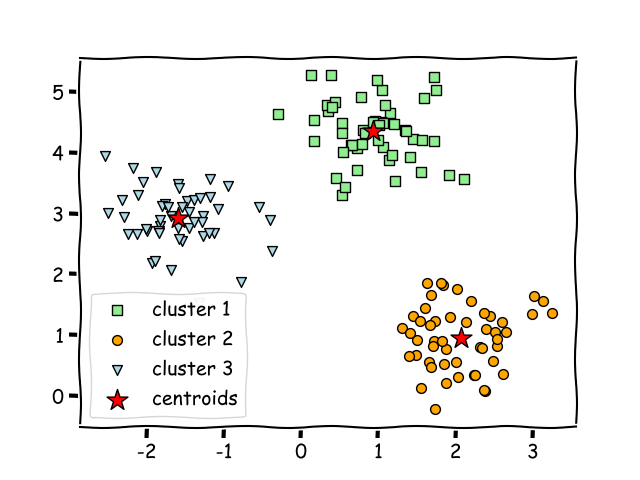
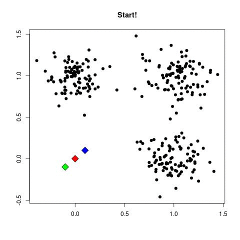
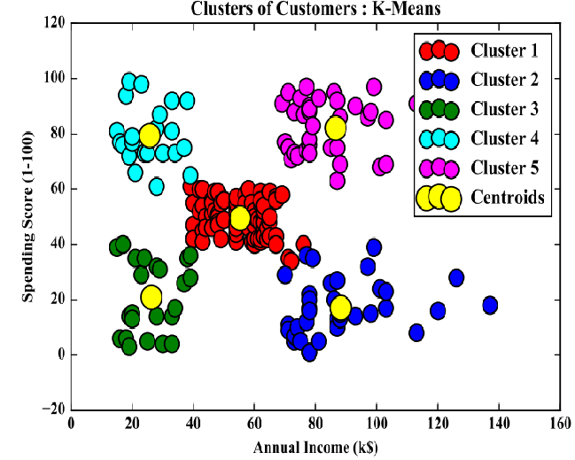

# <ins>K-Means Clustering</ins>

## What is Clustering?

**It is basically a type of unsupervised learning method . An 'unsupervised' machine learning method consists of datasets without target labelled variables.**

**Generally, it is used as a process to find meaningful structure, explanatory underlying processes, generative features, and groupings inherent in a set of examples.**

**In a more definitive version, Clustering is the task of dividing the population or data points into a number of groups such that data points in the same groups are more similar to other data points in the same group and dissimilar to the data points in other groups. It is basically a collection of objects on the basis of similarity and dissimilarity between them.**

Clustering can also be defined as the assignment of a set of observations into subsets (called clusters) so that observations in the same cluster are similar in some sense.

####    
 
 

#####       

### What are the different types of Clustering in machine learning?

There are mainly four different types of clustering:
- Centroid based Clustering
- Density based Clustering
- Distribution based Clustering
- Hierarchical clustering

To get a detail understanding of the above mentioned clustering types, visit [here](https://developers.google.com/machine-learning/clustering/clustering-algorithms)

### Most popular Clustering Algorithms

There are several Clustering algorithms available that are very unique in their own approach. Some of the famous among them are :

- K-Means Clustering Algorithm

- Fuzzy C-means (FCM) Algorithm

- Expectation-Maximisation (EM) Algorithm

**The most used and easy to use algorithm is the K-Means Clustering algorithm. Let's dive into it.**

## What is K-Means Clustering?

This is the most common clustering algorithm because it is easy to understand and implement. K-means clustering algorithm forms a critical aspect of introductory data science and machine learning.

K-Means Clustering follows the Centroid-based Clustering approach. For each cluster, a centroid is defined. The centroid is a data point present at the centre of each cluster (considering [Euclidean distance](https://sebastianraschka.com/faq/docs/euclidean-distance.html#:~:text=Machine%20Learning%20FAQ&text=For%20example%2C%20picture%20it%20as,of%20a%20particular%20sample%20point.)). The trick is to define the centroids far away from each other so that the variation is less. After this, each data point in the cluster is assigned to the nearest centroid.

After this, each centroid is again calculated to be in the center of each cluster. These new centroids need to assign to each data point in every data point in clusters. The whole process is repeated a number of times untill those centroids are fixed at the centre of their respective clusters and no longer moves.

A genreral example is shown below.

The main objective of the K-Means algorithm is to minimize the sum of distances between the points and their respective cluster centroid.

**Practical aplications:** 
- Sensor measurements, 
- Activity monitoring in a manufacturing process 
- Audio detection
- Image segmentation.

## Why do we use K-Means Clustering instead of other algorithms?

The K-means clustering algorithm is used to find groups which have not been explicitly labeled in the data. This can be used to confirm business assumptions about what types of groups exist or to identify unknown groups in complex data sets. Once the algorithm has been run and the groups are defined, any new data can be easily assigned to the correct group.

This is a versatile algorithm that can be used for any type of grouping. Some examples of use cases are:

- Behavioral segmentation:

    - Segment by purchase history
    - Segment by activities on application, website, or platform
    - Define personas based on interests
    - Create profiles based on activity monitoring
    
- Inventory categorization:

    - Group inventory by sales activity
    - Group inventory by manufacturing metrics
    
- Sorting sensor measurements:

    - Detect activity types in motion sensors
    - Group images
    - Separate audio
    - Identify groups in health monitoring
    
- Detecting bots or anomalies:

    - Separate valid activity groups from bots
    - Group valid activity to clean up outlier detection
    
#####  

<i>For a better understanding of different use cases of K-Means Clustering, refer to this [article](https://dzone.com/articles/10-interesting-use-cases-for-the-k-means-algorithm).</i>
    
### Advantages:

1. Relatively simple to implement.

2. Scales to large data sets.

3. Guarantees convergence.

4. Can warm-start the positions of centroids.

5. Easily adapts to new examples.

6. Generalizes to clusters of different shapes and sizes, such as elliptical clusters.

### Disadvantages:

1. Choosing the value of 'k' manually.
2. Being dependent on initial values.
3. Clustering data of varying sizes and density.
4. Clustering outliers.
5. Scaling with number of dimensions.

#####   

## Conclusion:

K-means clustering is an extensively used technique for data cluster analysis.

It is easy to understand, However, its performance is usually not as competitive as those of the other sophisticated clustering techniques because slight variations in the data could lead to high variance.

Furthermore, clusters are assumed to be spherical and evenly sized, something which may reduce the accuracy of the K-means clustering Python results.

#####  

For a more in-depth explanation on how to implement K-Means Clustering in Python, refer to this [notebook](https://github.com/PritamAich/Open-contributions/blob/master/Pritam_ML_KMeansClustering.ipynb).

####  

 -- By Pritam Aich
 
 **Connect With me at :**
 
 [Github](https://github.com/PritamAich) | [LinkedIn](https://www.linkedin.com/in/pritam-aich-05b7551b4/)

